## 模式识别大作业

作者：popfishy

给定一批图片，利用深度学习算法，判断该图片究竟是属于哪座建筑的一部分。测试集图片未知，测试集图片，需要说明几点：
* 测试图片均为前视视角图像；
* 测试图片中既可能包含指定的建筑物的某个部分，也可能包含非指定建筑的某个部分，还有可能不包含任何需要识别的建筑物。
* 要求最终的分类器按照下表输出相应的值。

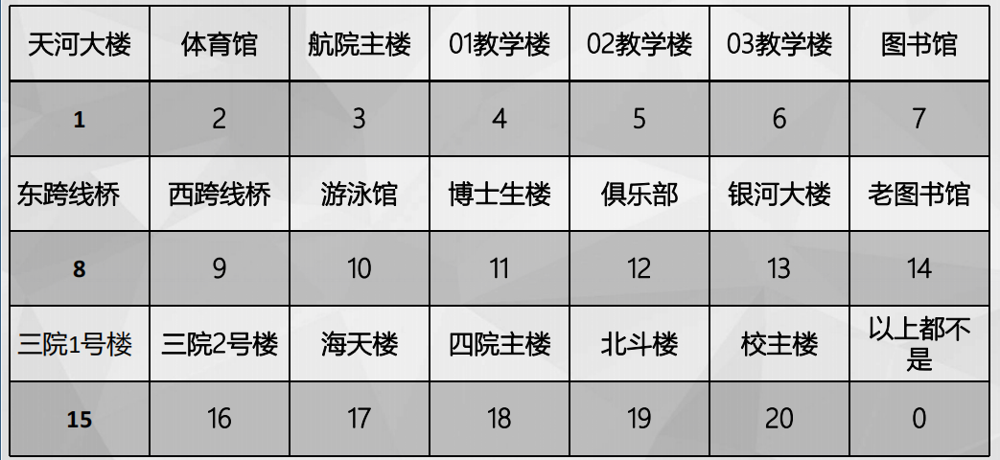

#### 1.要求

1. 对20类不同建筑样本进行分类，数据集需自行采集。
2. 测试集不包含夜晚的照片。
3. 采集时，设备以普通手机为主，采集后的图片会被裁剪、缩放。使用手机设备进行采集时，以前视视角进行拍摄，不会采用无人机拍摄建筑物的俯视图片。前视视角是指人在道路上正常行进的时候，从他的视角看到的建筑物的样子。但是前视视角不代表相机一定水平朝前正对着建筑物。将来测试集中肯定还有建筑物的侧面照片。正如课件中给大家展示过的体育馆照片，画面中就只有体育馆侧面的一个局部。但是拍摄点一般都会在主路附近，不会刻意跑到建筑物的犄角旮旯去拍摄建筑物。
4. 测试集包括一定比例负样本，负样本包含建筑类和非建筑类。

#### 2.需求分析
1. 对数据样本进行采集，其中采集的数据集文件夹目录层次如下：

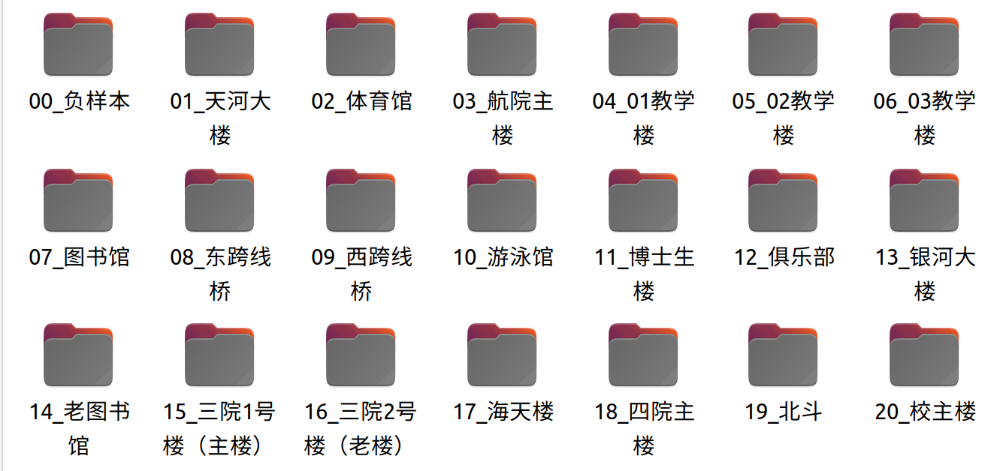

2. 数据采集完成后，需对数据进行处理：
- 数据清理：清理不符合要求的数据。比如树木等遮挡物超过80%的图片、拍摄过程中误拍的图片。
- 数据预处理：统一数据格式，并为了防止数据量过大，将原始图片压缩到100W像素。
- 数据增强：随机RGB(正负10)、随机亮度和对比度、随机仿射变换、随机裁剪。为了平衡不同类别之间的样本数量，每种类别统一增强到500张左右。
  处理结果下图：
  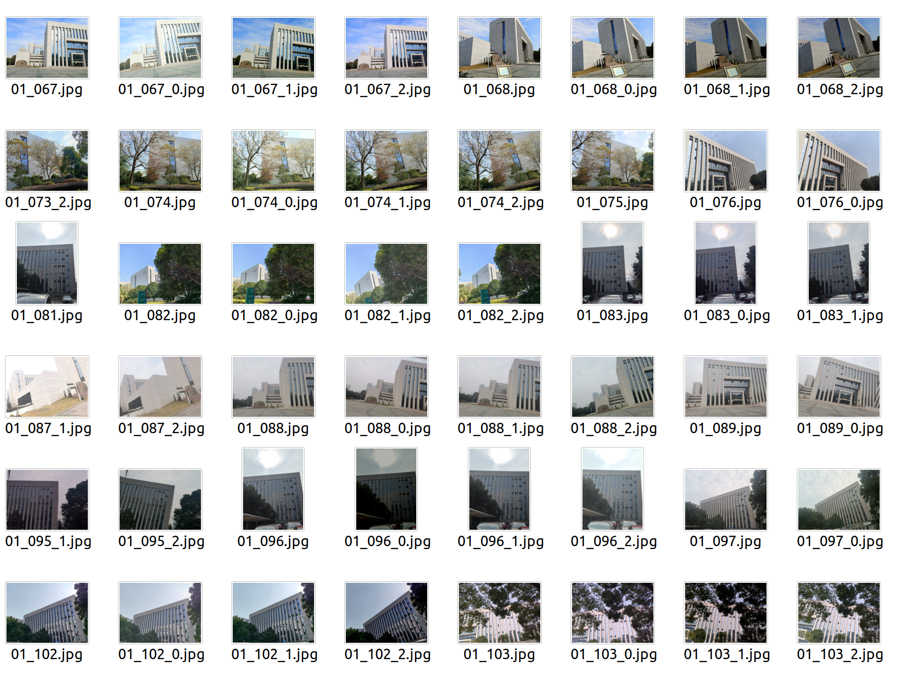

3. 20类样本+负样本共21类。负样本可以自行采集+网络上搜集建筑数据集+网络上相关建筑照片。

#### 3.训练环境
* 电脑型号：13th Gen Intel® Core™ i7-13700KF × 24 + RTX 4070Ti显卡
* Ubuntu20.04环境 + CUDA12.2
* Vscode开发环境

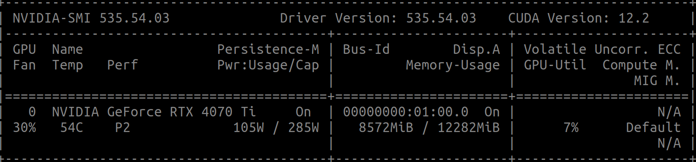

#### 4.结果
##### 1.Resnet50模型
1. 使用Resnet50模型微调
2. 训练结果Resnet50模型在测试集上的正确率在89%左右
   

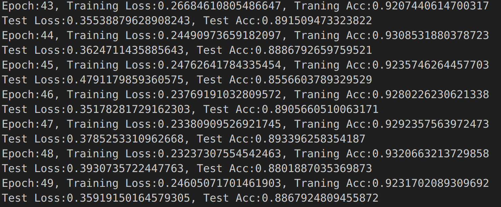

3. Loss曲线

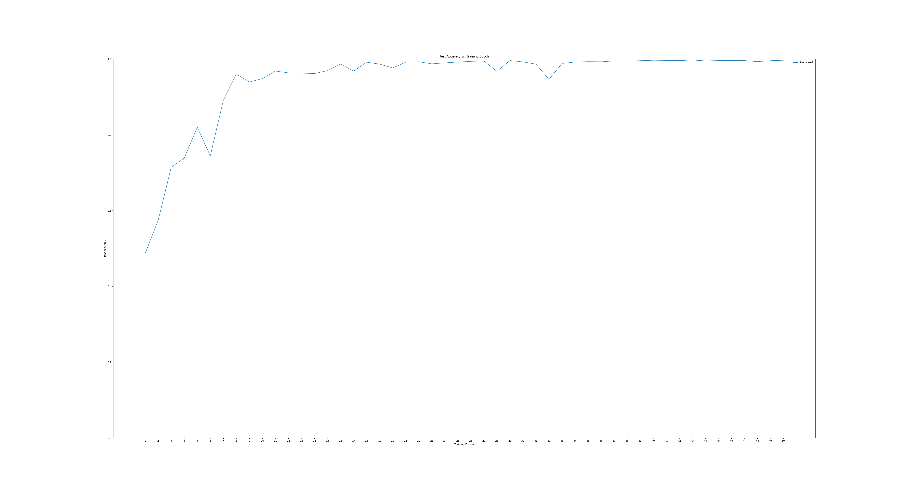

##### 2.Inception_Resnet_v2模型
1. 使用Inception_Resnet_v2网络进行训练
2. 训练过程中使用nvitop查看GPU占用率，使用System Monitor查看CPU占用情况

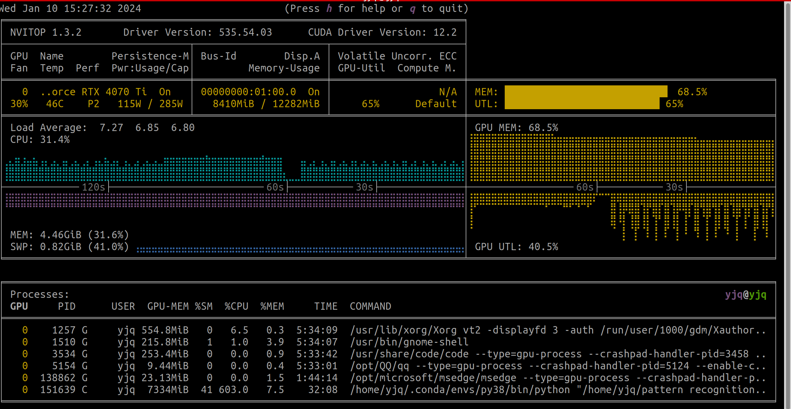

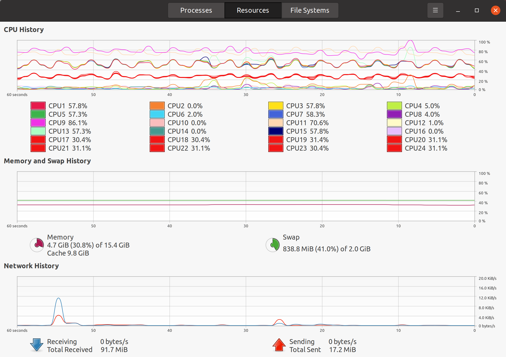

3. 训练结果显示Inception_Resnet_v2在测试集上的正确率能达到99.7%，完全满足任务需要

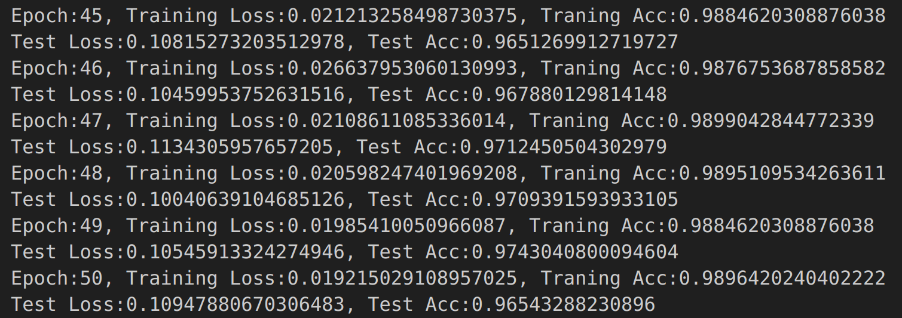

#### 5.测试
使用任务提供的未知的验证集，根据验证结果统计分类正确率。分析Inception_Resnet_V2网络最终效果如何。

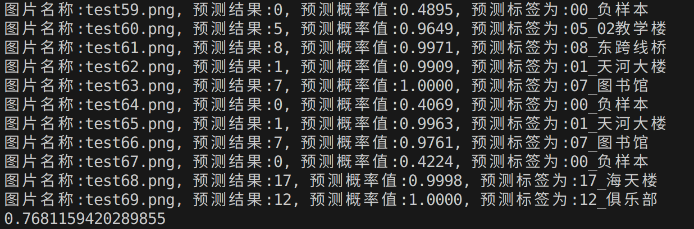

发现验证正确率为76.81%，分析原因可能有以下几点：
* 负样本很难考虑到三号院相似建筑物。
* 部分测试样本对比度和曝光较高，数据增强时阈值设置较低。
* 部分类别间相似度高，在仅提供有限视角的情况下，存在一定概率分类错误。

改进：
* 在网络上搜索国防科技大学相关图片，对图片进行爬取并人工去除场景识别中相关正样本，对剩下的负样本进行图像增强，加入到数据集负样本之中。
* 图像增强时，随机曝光度阈值提高。

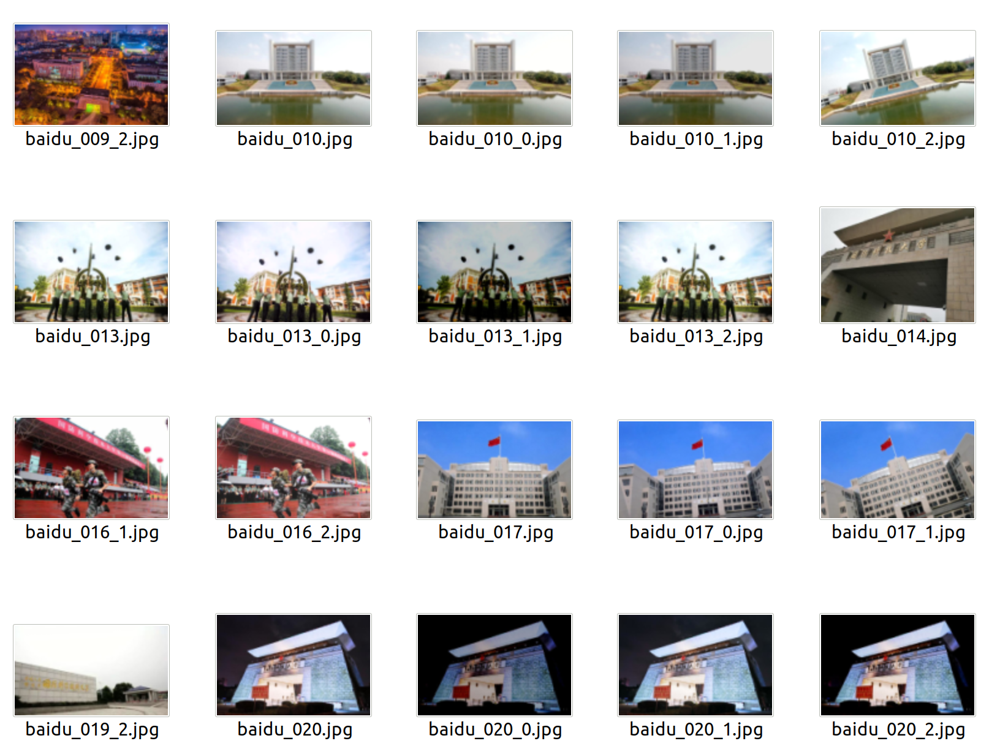

重新进行训练，并对网络进行微调，最终在训练集上正确率为98.4%正确率，测试集96.7%正确率。使用任务提供的未知的验证集，根据验证结果统计分类正确率。本次验证正确率提升到了85.5%。

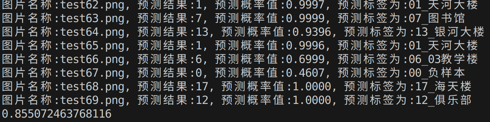

发现之前存在的负样本分类错误基本上去除，大部分错误主要是验证集部分图片年代稍显久远，曝光和色彩较差。下图尽管预测正确，但是预测概率值也仅仅为0.28，表示模型也极不确定其具体类别。

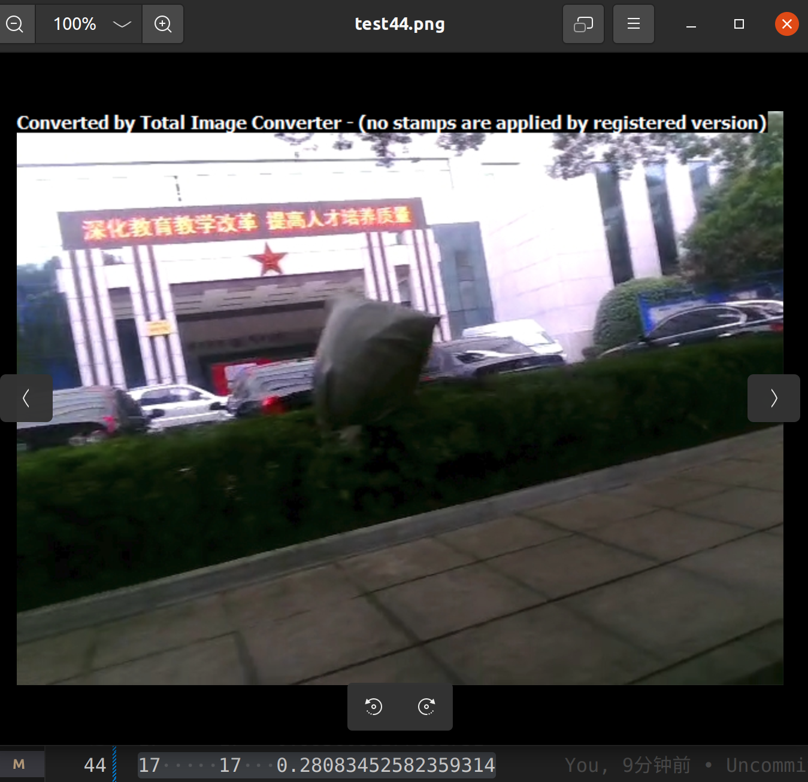

类似图片预测概率值都比较低，低于0.7,而正确分类样本的预测概率值都接近0.99.在具体分类时，可以将预测概率值较低的图片交给人类辅助处理。例如以下该种图片样本为预测值为西跨线桥，但是真实值却为东跨线桥。

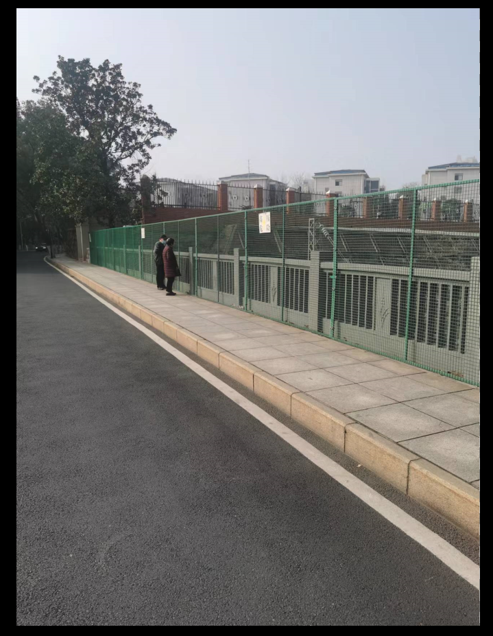

